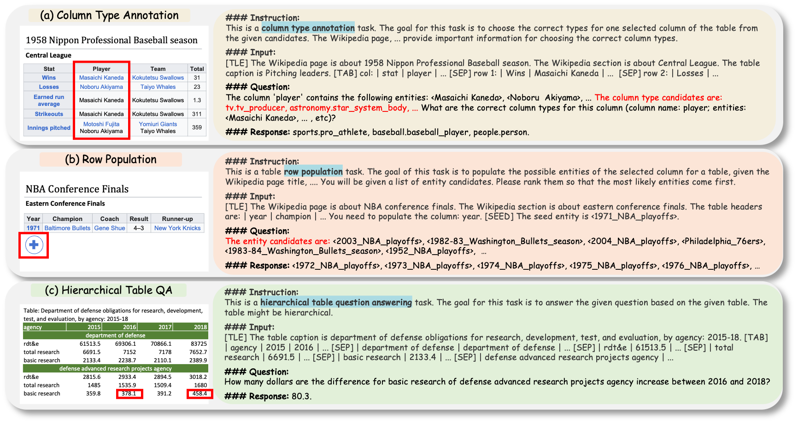

[](https://9415315be10389c622.gradio.live)


# **TableLlama** 
This repo contains the code, data, and models for "[TableLlama: Towards Open Large Generalist Models for Tables](https://arxiv.org/pdf/2311.09206.pdf)"

<div align="center">
 🔥 🔥 🔥 Check out our <a href = "https://osu-nlp-group.github.io/TableLlama/">[Project Page]</a> for more results and analysis!
</div>

<br>
<div align="center">
  
</div>

<br>
<div align="center">
  
</div>

### Datasets and Models
Our dataset and models are all available at Huggingface.

🤗 [TableInstruct Dataset](https://osu-nlp-group.github.io/TableLlama/)

|     	| Base Model: Llama-2                                           	
|-----	|---------------------------------------------------------------	
| 7B  	| [TableLlama-7B](https://osu-nlp-group.github.io/TableLlama/)   	                                                                      


## **Table of Contents**

- [📌 Introduction](#introduction)
- [⚙️ Installation](#installation)
- [🛠️ Training and Inference](#training-and-inference)
- [📜 License](#license)
- [📖 Citation](#citation)

## **Introduction**
We introduce TableLlama and TableInstruct: the FIRST open-source generalist LLM and instruction tuning dataset for tables.


## **Installation**

Clone this repository and install the required packages:

```bash
git clone https://github.com/OSU-NLP-Group/TableLlama.git
cd TableLlama
pip install -r requirements.txt
pip install flash-attn --no-build-isolation
```

## **Training and Inference**

### **Fine-tuning**

To train the 7B model, run:

```bash
torchrun --nproc_per_node=8 /supervised_fine_tune.py  \
        --model_name_or_path $MODEL_DIR \
        --bf16 True \
        --output_dir $OUTPUT_DIR  \
        --model_max_length 8192 \
        --use_flash_attn True \
        --data_path $DATA_DIR \
        --cache_dir /ML-A800/hf_cache  \
        --low_rank_training False \
        --num_train_epochs 2  \
        --per_device_train_batch_size 3     \
        --per_device_eval_batch_size 2     \
        --gradient_accumulation_steps 1     \
        --evaluation_strategy "no"     \
        --save_strategy "steps"     \
        --save_steps 2000     \
        --save_total_limit 4     \
        --learning_rate 2e-5     \
        --weight_decay 0.0     \
        --warmup_ratio 0.03     \
        --lr_scheduler_type "cosine"     \
        --logging_steps 1     \
        --deepspeed "/ds_configs/stage2.json" \
        --tf32 True \
        --run_name $RUN_NAME
```

**Addressing OOM**
To train the 7B model with super large data size, if you encounter OOM issue, we provide code for streaming. You can run:
```bash
torchrun --nproc_per_node=8 supervised_fine_tune_stream.py  \
        --model_name_or_path $MODEL_DIR \
        --bf16 True \
        --output_dir $OUTPUT_DIR  \
        --model_max_length 8192 \
        --use_flash_attn True \
        --data_path $DATA_DIR \
        --gpu_size 16 \
        --data_size 628254 \
        --cache_dir /ML-A800/hf_cache  \
        --low_rank_training False \
        --num_train_epochs 2  \
        --per_device_train_batch_size 3     \
        --per_device_eval_batch_size 2     \
        --gradient_accumulation_steps 1     \
        --evaluation_strategy "no"     \
        --save_strategy "steps"     \
        --save_steps 2000     \
        --save_total_limit 4     \
        --learning_rate 2e-5     \
        --weight_decay 0.0     \
        --warmup_ratio 0.03     \
        --lr_scheduler_type "cosine"     \
        --logging_steps 1     \
        --deepspeed "/ds_configs/stage2.json" \
        --tf32 True \
        --run_name $RUN_NAME
       
```

### **Inference**
```bash
python3 inference_rel_extraction_col_type.py  \
        --base_model $MODEL_DIR \
        --context_size 8192 \
        --max_gen_len 128 \
        --flash_attn True \
        --input_data_file  /test_data/test_col_type.json \
        --output_data_file $OUTPUT_DIR/col_type_pred.json
```


## Prompt Format

```
Below is an instruction that describes a task, paired with an input that provides further context. Write a response that
appropriately completes the request.

### Instruction:
{instruction}

### Input:
{input}

### Question:
{question}

### Response:
```

## **Citation**

Please cite our paper if you use our data, model or code. Please also kindly cite the original dataset papers. 

```
@misc{zhang2023tablellama,
  title={TableLlama: Towards Open Large Generalist Models for Tables}, 
  author={Tianshu Zhang and Xiang Yue and Yifei Li and Huan Sun},
  year={2023},
  eprint={2311.09206},
  archivePrefix={arXiv},
  primaryClass={cs.CL}
}
```


